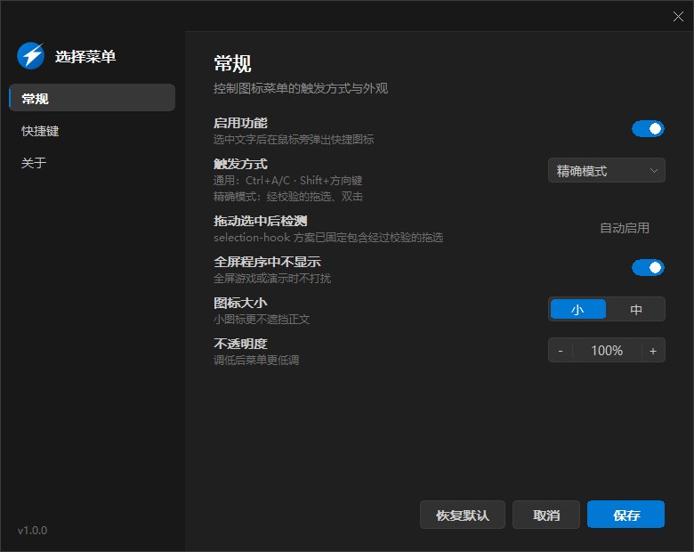
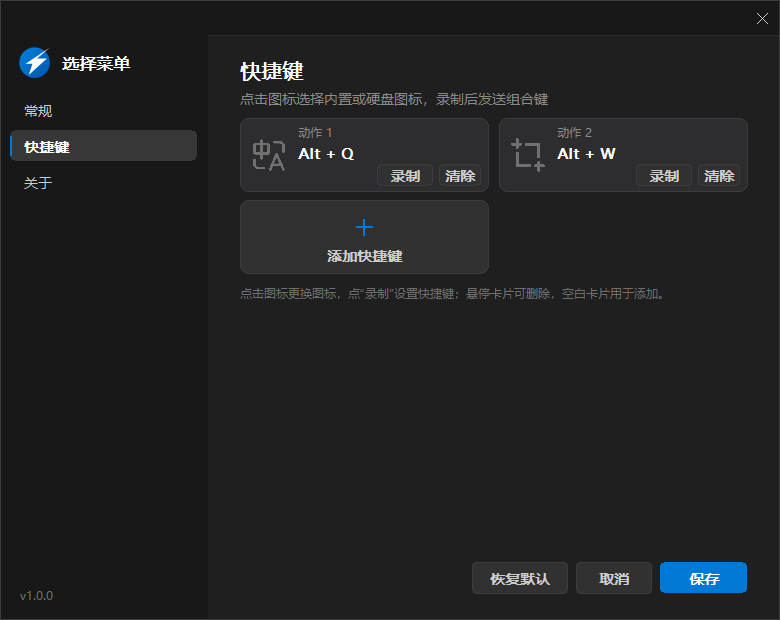
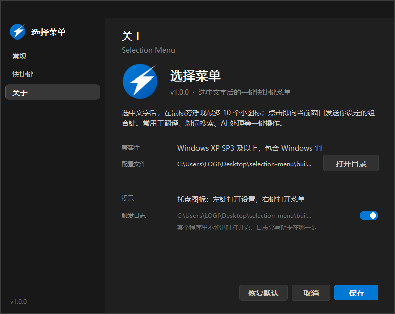

# Selection Menu / 选择菜单

选中文字后，在鼠标下方弹出图标菜单；点击图标即可执行预设快捷键。

支持 Windows XP–Windows 11。

| 常规 | 快捷键 | 关于 |
| :---: | :---: | :---: |
|  |  |  |

## 使用

1. 运行 `build\selection-menu.exe`。
2. 左键托盘图标打开设置。
3. 在“常规”页选择触发方式：
   - **精确模式（默认）**：拖选、双击。
   - **兼容模式**：双击、三击、拖选。
4. 在应用中选中文字，菜单会显示在鼠标下方。
5. 点击图标执行动作；点击菜单或其它位置关闭菜单。

两种模式均支持：

- `Ctrl+A` 全选
- `Ctrl+C` 复制
- `Shift+方向键` 扩展选区

## 设置

- **启用功能**：总开关。
- **触发方式**：兼容模式 / 精确模式。
- **拖动选中后检测**：兼容模式下控制拖选检测。
- **全屏程序中不显示**：全屏时隐藏菜单。
- **图标大小**、**不透明度**：调整菜单外观。
- **快捷键页**：添加最多 10 个动作，录制组合键并选择图标。

配置保存在可执行文件同目录的 `settings.ini`。

## 不弹出时

1. 打开设置 → “关于”。
2. 开启“触发日志”。
3. 重新操作一次。
4. 查看同目录的 `trace.log`。

## 限制

- 不支持文字选区的控件可能无法触发。
- Chrome 工具栏、系统桌面、任务栏和资源管理器会被过滤。
- 以管理员身份运行的目标窗口可能无法接收普通权限程序发送的按键。

开发者文档见 [DEVELOPMENT.md](DEVELOPMENT.md)。
